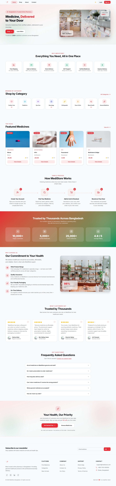
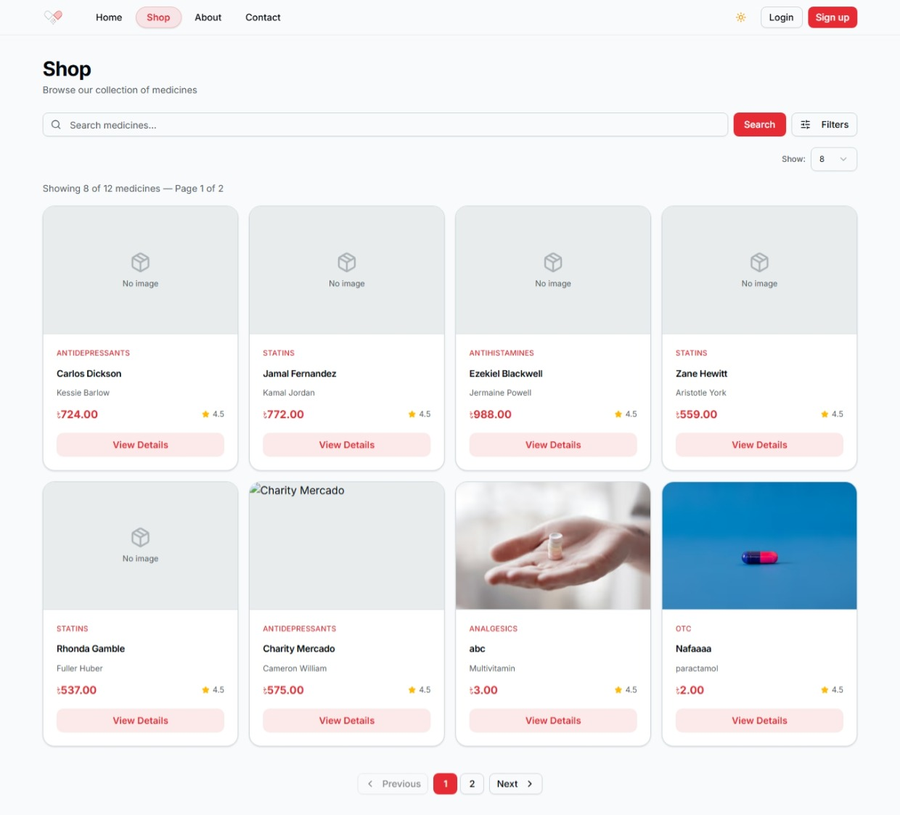
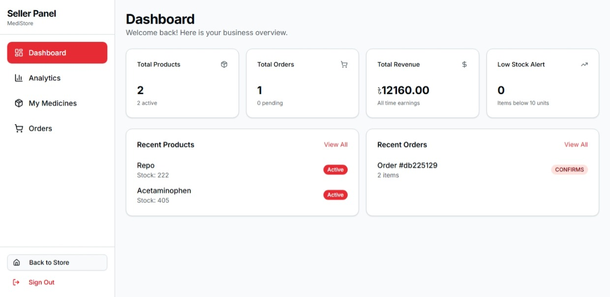
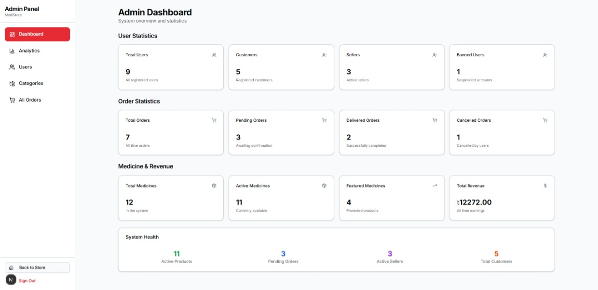

<div align="center">

# 💊 MediStore — Frontend Portal

**A fully responsive, role-aware medicine e-commerce interface — order medicines from anywhere in Bangladesh, managed by a multi-seller ecosystem.**

[](https://nextjs.org/)
[](https://react.dev/)
[](https://www.typescriptlang.org/)
[](https://tailwindcss.com/)
[](https://tanstack.com/form)
[](https://zod.dev/)
[](https://medistore-medicine.vercel.app)
[](LICENSE)

<p>
  <a href="#-project-overview">Overview</a> •
  <a href="#-problem-statement">Problem</a> •
  <a href="#-role-based-access-rbac">RBAC</a> •
  <a href="#-ui--state-architecture">Architecture</a> •
  <a href="#-application-routes">Routes</a> •
  <a href="#-folder-structure">Structure</a> •
  <a href="#-getting-started">Setup</a>
</p>

</div>

---

## 🖼 Screenshots

### 🏠 Home Page


### 💊 All Medicines 


### 🏪 Seller Dashboard


### 📋 Admin Dashboard


---

## 📖 Project Overview

**MediStore Frontend** is the production-grade unified portal for the MediStore platform — a multi-seller online medicine marketplace designed specifically for Bangladesh. It connects customers who need medicines with verified sellers, while a centralized admin layer oversees every transaction and maintains platform integrity.

> **Live Demo:** [https://medistore-medicine.vercel.app](https://medistore-medicine.vercel.app)
>
> **Backend API:** [https://medistore-med.vercel.app](https://medistore-med.vercel.app) · **Backend Repo:** [MediStore-Backend](https://github.com/ambakhtiar/MediStore-Backend)
>
> **Demo Video:** [Google Drive](https://drive.google.com/file/d/1rUm70KWWNz2Up-CCXjgP0KVZCTt18e9q/view?usp=sharing)

---

## 🎯 Problem Statement

In Bangladesh, buying medicines online is fragmented and untrustworthy. Customers often cannot verify stock availability, sellers have no unified platform to manage their inventory digitally, and there is no central oversight to ensure order integrity. MediStore solves this by building a structured multi-seller marketplace where:

- Customers from anywhere in Bangladesh can browse and order medicines from multiple sellers in one place
- Sellers independently manage their own catalogues and order fulfilment
- Admins monitor every order, user, and seller activity from a unified dashboard
- Reviews are gated behind successful delivery — ensuring only genuine feedback appears

---

## 🛡️ Role-Based Access (RBAC)

Every interface element adapts based on the authenticated user's role. Access is enforced at both the layout and component level.

| Role | Core Capabilities |
|:---|:---|
| 🌍 **Guest (Public)** | Browse medicine catalogue, view categories and product details, read reviews |
| 🛒 **Customer** | Place orders from any location in Bangladesh, track order status, write reviews for received products |
| 🏪 **Seller** | Manage their own medicine listings, process and update order statuses, view seller analytics |
| 👑 **Admin** | Full platform oversight — monitor all orders, manage all users, ban/unban accounts, oversee all sellers |

### Platform Workflow

```
Customer places order
        │
        ▼
Admin reviews and monitors the order
        │
        ▼
Seller processes and ships the product
        │
        ▼
Admin oversees delivery to the customer
        │
        ▼
Customer receives product → eligible to write a review
```

---

## 🏗 UI & State Architecture

### State Management

No heavy global state library (e.g. Redux) is used. The project takes a modern, lightweight approach:

- **React Context API** — Global state such as cart and user preferences
- **Server Actions** — Data synchronization between client and server without redundant API layers
- **Better Auth Client** — User session and authentication state management
- **URL-based State** — Filtering, sorting, and searching in data tables use `URL Search Parameters`, preserving state across page refreshes

### Form Management — TanStack Form + Zod

- **TanStack Form** handles all form state with zero re-renders on unrelated field changes
- **Zod** defines validation schemas shared with the backend — keeping contracts in sync
- Field-level validation runs at the time of typing for instant user feedback

### Rendering Strategy

| Route | Strategy | Reason |
|---|---|---|
| Landing / Home | Static Generation | No dynamic data |
| Medicine Catalogue | Server Component | SEO + fast initial paint |
| Product Detail | Server Component | SEO for medicine names |
| Dashboards | Client Component | High interactivity, role-specific data |
| Auth Screens | Client Component | Form state, session cookie management |
| Tables (Admin/Seller) | Client Component | URL-based filter/sort state |

---

## 🗺 Application Routes

### Public Routes

| Route | Purpose |
|---|---|
| `/` | Landing page — featured medicines, categories |
| `/medicines` | Full medicine catalogue with search, filter, and pagination |
| `/medicines/[id]` | Single medicine detail with reviews |
| `/auth/login` | User login |
| `/auth/register` | Registration — Customer or Seller role selection |

### Customer Routes

| Route | Purpose |
|---|---|
| `/cart` | Shopping cart |
| `/orders` | My order history |
| `/orders/[id]` | Order detail and tracking |
| `/profile` | My profile and account settings |

### Seller Dashboard — `/seller/*`

| Route | Purpose |
|---|---|
| `/seller` | Seller analytics — sales, stock overview |
| `/seller/medicines` | My listed medicines |
| `/seller/medicines/add` | Add new medicine listing |
| `/seller/medicines/[id]/edit` | Edit an existing listing |
| `/seller/orders` | Orders for my medicines — update status |

### Admin Panel — `/admin/*`

| Route | Purpose |
|---|---|
| `/admin` | Platform-wide analytics dashboard |
| `/admin/users` | All registered users — ban/unban |
| `/admin/medicines` | All medicines across all sellers |
| `/admin/orders` | All platform orders |
| `/admin/categories` | Manage medicine categories |

---

## 📁 Folder Structure

`src/` follows a clean **Feature-Sliced** pattern to keep domain logic separate and ownership boundaries clear.

```
src/
├── action/          # Server Actions — API calls and data revalidation
├── app/             # Next.js App Router — all pages, layouts, and routing
│   ├── (common)/    # Customer & public routes (Shop, Cart, Profile)
│   ├── admin/       # Admin dashboard and user management
│   ├── seller/      # Seller dashboard and inventory management
│   └── auth/        # Login and registration pages
├── components/
│   ├── modules/     # Feature-specific components (Cart, Order, Review, etc.)
│   └── ui/          # Generic shadcn/ui primitives (Button, Input, etc.)
├── hooks/           # Custom hooks — e.g. useDataTable (table sorting/filtering)
├── lib/             # Shared configs — Better Auth, Cloudinary, Prisma
├── services/        # Service Layer — API fetch logic
├── types/           # TypeScript interfaces and type definitions
└── env.ts           # Environment variable type-checking and validation
```

---

## 🛠 Tech Stack

| Category | Technology |
|---|---|
| Framework | Next.js 14 (App Router) |
| Language | TypeScript 5 (strict mode) |
| UI Library | React 18 |
| Styling | Tailwind CSS 3 |
| Component Primitives | shadcn/ui + Radix UI |
| Form State | TanStack Form + Zod adapter |
| Validation | Zod v3 |
| Authentication | Better Auth (session-based) |
| State Management | React Context API + URL Search Params |
| Data Layer | Next.js Server Actions |
| Deployment | Vercel |

---

## ⚙️ Getting Started

### Prerequisites

- Node.js 18+
- A running instance of the [MediStore Backend](https://github.com/ambakhtiar/MediStore-Backend) (local or deployed)

### 1. Clone & Install

```bash
git clone https://github.com/ambakhtiar/MediStore-Frontend.git
cd MediStore-Frontend
npm install
```

### 2. Configure Environment

```bash
cp .env.example .env.local
```

### 3. Start Dev Server

```bash
npm run dev
# Navigate to http://localhost:3000
```

---

## 🔧 Environment Variables

```env
API_URL=http://localhost:5000/api
AUTH_URL=http://localhost:5000/api/auth

NEXT_PUBLIC_URL=http://localhost:5000
NEXT_PUBLIC_API_URL=http://localhost:5000/api
```

For production on Vercel, set `NEXT_PUBLIC_BASE_API` to:
```
https://medistore-med.vercel.app
```

---

## 📜 Available Scripts

| Script | Command | Description |
|---|---|---|
| `dev` | `next dev` | Start dev server with hot-reload |
| `build` | `next build` | Compile for production |
| `start` | `next start` | Serve the production build |
| `lint` | `next lint` | Run Next.js-tuned ESLint rules |

---

## 🚀 Deployment (Vercel)

1. Push your repository to GitHub
2. Import at [vercel.com/new](https://vercel.com/new)
3. Set `NEXT_PUBLIC_BASE_API` to your production backend URL
4. Click **Deploy** — subsequent pushes to `main` deploy automatically

---

## 🔗 Links

| | |
|---|---|
| **Live Frontend** | [medistore-medicine.vercel.app](https://medistore-medicine.vercel.app) |
| **Live API** | [medistore-med.vercel.app](https://medistore-med.vercel.app) |
| **Backend Repo** | [MediStore-Backend](https://github.com/ambakhtiar/MediStore-Backend) |
| **Demo Video** | [Google Drive](https://drive.google.com/file/d/1rUm70KWWNz2Up-CCXjgP0KVZCTt18e9q/view?usp=sharing) |

---

## 📄 License

Distributed under the **MIT License**. See `LICENSE` for details.

---

<div align="center">
  <p>Designed & developed by <strong>Abdullah Muhammad Bakhtiar</strong></p>
  <a href="https://github.com/ambakhtiar/MediStore-Frontend">Frontend</a> ·
  <a href="https://github.com/ambakhtiar/MediStore-Backend">Backend</a> ·
  <a href="https://medistore-medicine.vercel.app">Live Demo</a>
</div>